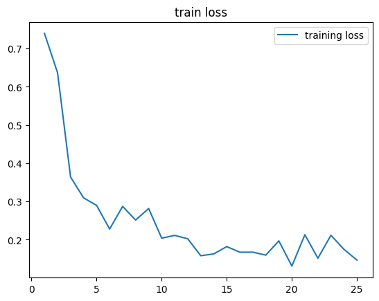

# ImageClassification

Image Classification (Pizza and Ice cream)

Aldo Tena García - A01275222

# Generación o selección del set de datos

El dataset seleccionado para este modelo es "Pizza vs Ice Cream", fue descargado de la plataforma kaggle ([Pizza vs Ice Cream](https://www.kaggle.com/datasets/hemendrasr/pizza-vs-ice-cream)) el 14 de mayo del 2024.La razón prinicipal para la selección de este dataset fue el objetivo de comparar 2 elementos diferentes usando el modelo a desarrollar, en este caso 2 alimentos diferentes, ademas de la estructura ya definida del set (con las carpetas train y test con sus respectivos tags) y la cantidad inicial de imagenes contenidas en el dataset. Después de ver nuevamente la cantidad de imagenes necesarias para entrenar y verificar el correcto funcionamiento del modelo se modifico la cantidad de imágenes (450 en total por categoria despues de elementar imágenes repetidas o incorrectas) presentes dentro de los datasets para dejar 90 imágenes dentro de las carpetas de test y 360 imágenes dentro de la carpeta de train, esto quedo en una proporción de 80-20 entre train y test.

Después de seleccionar el dataset se investigo en Google Académico modelos similares al que se propuso desarrollar, lo mása cercano al modelo propuesto eran multiples articulos en el que usaban modelos de CNN (Convolutional neural network) para clasificar multiples tipos de alimentos, para el desarrollo de este modelo se seleccionaron los siguientes articulos:

* [1] AMIN, Muhammad Zain; ALI, Amir. InceptFood: A CNN Based Classification Approach for Recognizing Food Images. En  *National Conference on Emerging Trends in Computing, Satisics and Mathematical Sciences, SBBWU* . 2017.
* [2] M. T. Islam, B. M. N. Karim Siddique, S. Rahman and T. Jabid, "Food Image Classification with Convolutional Neural Network," 2018 International Conference on Intelligent Informatics and Biomedical Sciences (ICIIBMS), Bangkok, Thailand, 2018, pp. 257-262

# Preprocesado de los datos

Para poder entrenar de la mejor posible el modelo se hara uso de tecnicas de data augmentation para poder suministrar los recursos necesarios para el entrenamiento y verificación del modelo, para esto se usaron los parametros propuestos por AMIN et al. [1]:

* Rotate left -30 degree
* Rotate right +30 degree
* Flip horizontally about Y axis
* Shear by a certain amount
* Rotate left +90 degree

Las imagenes fueron escaladas y posteriormente generadas con las dimensiones 224*224*3 de acuerdon con M. T. Islam et al. [3].

# Implementación de modelo

Al momento de elegir la implementación de un posible modelo se selecciono la implementació propuesta por M. T. Islam et al. [3], los factores que estuvieron involucrados en la selección de este modelo, como la documentación del mismo dentro de su respectivo articulo y el uso de herramientas previamente expuestas en clases.

El modelo seleccionado consta de 5 diferentes capa convolucionales con funciones de activación ReLu que terminan en una neurona de la función softmax, en este caso en especifico como se tiene un problema de clasificación binario se opto por cambiar esta por una neurona con una función sigmoid. De acuerdo con M. T. Islam et al. [3] se van a considerar 25 epochs como primer acercamiento y ejecución del modelo.

# Evaluación inicial del modelo

Como se puede ver en las imagenes obtenidas de la primera ejecución del modelo, especificamente en la etapa de train, este obtiene un promedio de accuracy del 95% alrededor de la epoch 20 y se mantiene dentro de un rango entre el 92-95% mientras que el loss llega a su punto más bajo en la epoch 20, despues de la mismas esta empieza a subir nuevamente.

El valor obtenido en test accuracy fue de: 0.7666666507720947, esta marca una diferencia de cerca del 20% entre train y test accuracy por lo que se puede observar un caso de overfitting.

